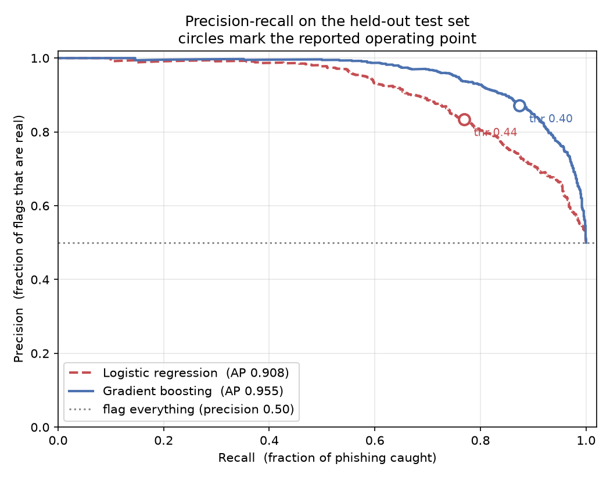

# Phishing URL Detector

A machine learning classifier that predicts whether a URL is phishing or benign
from the **text of the URL alone** — no network requests to the URLs themselves.

Built as an undergraduate project in AI applied to cyber security. The
interesting part of this repo is not the accuracy number; it is the record of
finding out that the first accuracy number was fake.

---

## Status

**Week 3 of 8 complete.** Three-way split, gradient boosting, threshold tuned on
validation, test set touched once.

| Model | AUC | Precision | Recall | False alarms | Missed attacks |
|---|---|---|---|---|---|
| Logistic regression (25 features) | 0.893 | 0.835 | 0.769 | 174 | 264 |
| **Gradient boosting** | **0.949** | **0.872** | **0.874** | **147** | **144** |

Held-out test set: 2,286 URLs, 1,143 phishing / 1,143 benign. Thresholds (0.44
and 0.40) were chosen on a separate validation split; the test set was evaluated
exactly once.



Each point on a curve is one possible decision threshold. Gradient boosting sits
above logistic regression at *every* threshold, which is a stronger claim than
comparing the two models at one arbitrary cut-off. The circles mark the reported
operating points. The dotted line at 0.50 is what a model that flags every URL
would score on this balanced test set — the floor any real model must beat.

**Caveat stated up front:** the test set is balanced 50/50. Real traffic is not —
benign URLs outnumber phishing by orders of magnitude. Under that imbalance
recall would hold but precision would fall sharply, because false alarms scale
with the volume of benign traffic while true catches do not. These numbers are
honest for what they measure and should not be read as deployment performance.

---

## The score arc

The headline result is the shape of this table, not its last row.

| Stage | Accuracy | What it means |
|---|---|---|
| Week 1 baseline, 5 features | 0.92 | **Not real.** A dataset artifact. |
| Week 2, artifact removed | 0.66 | First honest number. |
| Week 2, 25 features | 0.81 | Earned. |
| Week 3, gradient boosting | 0.87 | AUC 0.949. |

### What went wrong in week 1

Week 1 paired phishing URLs from **OpenPhish** against benign domains from
**Tranco**. That looks reasonable and is quietly fatal. OpenPhish supplies full
URLs with paths, averaging ~52 characters. Tranco supplies bare hostnames,
averaging ~20. The two classes were therefore distinguishable by a property that
has nothing whatsoever to do with phishing.

The model scored 0.92 by learning *"does this URL have a slash after the
domain?"* — an artifact of how the data was collected, not a fact about the
world. The evidence was in the weights: `url_length` carried weight 4.50, far
above every other feature.

### Two attempted fixes, one of which worked

**Widening the benign sample** from Tranco's top 20k to a random draw across
500k ranks, so the benign class wasn't only famous domains. This barely moved
the score (0.93 → 0.92), which proved domain fame was never the leak.

**Replacing the dataset entirely** with
[`pirocheto/phishing-url`](https://huggingface.co/datasets/pirocheto/phishing-url)
— 11,429 URLs where both classes come from one source and both are full URLs
with paths. This worked. Accuracy fell to 0.66 and the `url_length` weight
collapsed from 4.50 to 0.12.

Mean URL length by class moved from 20.4 / 51.7 (a 2.53× gap, almost entirely
artifact) to 47.4 / 74.9 (a 1.58× gap, plausibly real signal).

**The lesson:** a suspiciously good score is a bug report. If two classes were
collected in different ways, the model will find that difference before it finds
anything you care about.

---

## Features

25 lexical features, extracted by `src/features.py`. Host and path are treated
separately — the same character means different things in different places (see
Findings).

| Group | Features |
|---|---|
| Length | `url_length`, `host_length`, `path_length`, `query_length` |
| Structure | `num_subdomains`, `num_dots`, `num_hyphens`, `num_hyphens_host`, `path_depth`, `num_query_params` |
| Character composition | `digit_ratio`, `digit_ratio_host`, `special_ratio`, `num_percent`, `host_entropy` |
| Classic deception tricks | `has_at`, `has_ip`, `has_port`, `double_slash_in_path`, `https_token_in_host` |
| Reputation proxies | `is_https`, `suspicious_tld`, `is_shortener` |
| Content signals | `num_phish_hints`, `brand_outside_domain` |

Which of these the model actually relies on, measured by permutation importance
(shuffle one feature into noise, see how much performance drops):

```
path_depth              0.0638
path_length             0.0439
num_phish_hints         0.0402
num_subdomains          0.0378
num_dots                0.0330
```

The model leans hardest on the shape of the path. That is a testable prediction
for week 6: flattening a phishing URL's path should hurt it more than any other
single edit.

---

## Data

| Purpose | Source | Size |
|---|---|---|
| Training and evaluation | [`pirocheto/phishing-url`](https://huggingface.co/datasets/pirocheto/phishing-url) (HuggingFace) | 11,429 URLs, both classes one source |
| Live phishing pool | [OpenPhish](https://openphish.com) community feed | 900 URLs and growing, collected daily |
| Benign domain reference | [Tranco](https://tranco-list.eu) | sampled across 500k ranks |

`src/accumulate.py` runs as a daily scheduled job, merging each new OpenPhish
snapshot into a growing pool — any single fetch returns only ~300 URLs. This
pool is reserved for week 5's evaluation against *currently live* phishing.

**Datasets are gitignored and never committed.** The phishing pool contains live
malicious URLs; committing it would get the repo flagged by GitHub's malware
scanning.

---

## Findings

Things that came out of looking at the data rather than reading the score.

**1. Two textbook features are nearly extinct.** In a live 2026 OpenPhish feed,
only 4 of 300 phishing URLs used the `@` userinfo trick and only 1 of 300 used a
raw IP address. Both are canonical features throughout the phishing-detection
literature. Modern phishing abuses reputable hosting instead — OpenPhish reports
~35% of live phishing served from Cloudflare and ~12% from AWS, and the pool is
full of `*.pages.dev` and `backblazeb2.com` subdomains.

But rare is not the same as uninformative: in the larger 2020 reference set,
`has_at` appears in 4.3% of phishing URLs and in *exactly zero* benign ones. The
feature was unlearnable at n=300, not useless. Features inherited from older
papers should be validated against current data before being trusted — and
before being discarded.

**2. Hyphens flip meaning depending on where they are.** `num_hyphens_host` has
weight +0.66 (pushes toward phishing) while `num_hyphens` across the whole URL
has weight −1.23 (pushes toward benign). Hyphens in a hostname look like
`paypal-secure-login.com`. Hyphens anywhere look like a blog slug:
`/how-to-make-homemade-insecticidal-soap/`. This is the concrete argument for
separating host features from path features rather than counting over the whole
string.

**3. Correlated features produce misleading weights.** `has_ip` is roughly 50×
enriched in phishing, yet it acquired a small *negative* linear weight — because
an IP address is entirely digits, so `digit_ratio_host` already captures it. A
worked example of why linear coefficients cannot be read as feature importance.

**4. Accuracy hid a complete behavioural reversal.** Between two week-2 runs,
accuracy moved 0.93 → 0.92 while the model flipped from 1 false alarm and 8
missed attacks to 8 false alarms and 2 missed attacks. Nearly the same accuracy,
opposite security postures. This is the project's strongest argument against
reporting accuracy for a security classifier.

---

## Roadmap

- [x] **Week 1** — data collection, 5 features, logistic regression baseline
- [x] **Week 2** — fix collection leakage, expand to 25 features
- [x] **Week 3** — three-way split, gradient boosting, threshold tuning, PR curves
- [ ] **Week 4** — character-level CNN in PyTorch
- [ ] **Week 5** — model comparison, error analysis, recall against live phishing
- [ ] **Week 6** — adversarial evasion testing
- [ ] **Week 7** — FastAPI endpoint, CLI, packaging
- [ ] **Week 8** — write-up

Week 6 is the intended headline. The feature list above is, read the other way,
an evasion guide: it says exactly what to change about a URL to slip past this
model. The plan is to apply those mutations to phishing URLs the model currently
catches and measure how far recall collapses.

---

## Repository layout

| File | Purpose |
|---|---|
| `src/accumulate.py` | Daily job. Grows the live OpenPhish pool, caches Tranco monthly. |
| `src/reference_data.py` | Downloads the HuggingFace reference dataset. |
| `src/features.py` | Extracts the 25 lexical features. |
| `src/evaluate.py` | **Current evaluator.** Three-way split, both models, permutation importance. |
| `src/plot_curves.py` | Precision-recall and ROC curves → `reports/`. |
| `src/train.py` | Week 1–2 baseline. Superseded, kept as the reference point the story is told against. |
| `src/get_data.py` | Week 1 OpenPhish+Tranco builder. Superseded — this is the code that produced the artifact. |

---

## Setup

```bash
python -m venv .venv
.venv\Scripts\activate          # Windows
pip install -r requirements.txt

python src/reference_data.py    # download the training dataset
python src/features.py          # extract features
python src/evaluate.py          # train and evaluate
python src/plot_curves.py       # write PR and ROC curves to reports/
```

`python src/accumulate.py` refreshes the live phishing pool; it is not needed to
reproduce the results above.

---

## Safety note

This project downloads *lists* of phishing URLs as text and never requests them.
Do not add any feature that fetches a URL — that sends traffic from your IP to
live attacker infrastructure, confirms to the operator that the URL is being
examined, and risks serving you malware. Every feature here is computed from the
URL string offline, which is a deliberate design constraint, not a limitation
waiting to be fixed.
